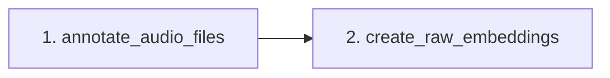

## Voice Authenticator

Download data from https://huggingface.co/datasets/ProgramComputer/voxceleb and place it inside the data folder.

The data folder should contain two directories:

* `vox1_dev_wav`
* `vox1_test_wav`

Each of those folders should have the following structure:

* `wav `folder ↓
    * many directories named like `idXYZPQ` ↓
        * many directories with random names ↓
            * `*.wav` files

The data folder should also contain a vox1_vox1_meta.csv. It's tracked by git, so it should be there by default.

Project stages are contained in jupyter notebooks in the [src/notebooks](src/notebooks) directory in order to facilitate 
quick edits and live data inspection.

Stages:

1. [annotate_audio_files](src/notebooks/annotate_audio_files.ipynb) - checks audio files from the VoxCeleb1 dataset and creates
   a `annotations_with_metadata.json` file, which contains all the relevant information for each
   audio recording - it's path relative to the project root, user_id, train/test split etc.
2. [create_raw_embeddings](src/notebooks/create_raw_embeddings.ipynb) - given an embedding SpeechBrain model name and an annotation file
containing audio paths relative to the project root creates embeddings for all audio recordings and saves them using the 
[pickle](https://docs.python.org/3/library/pickle.html) format.

Stage dependencies graph:

